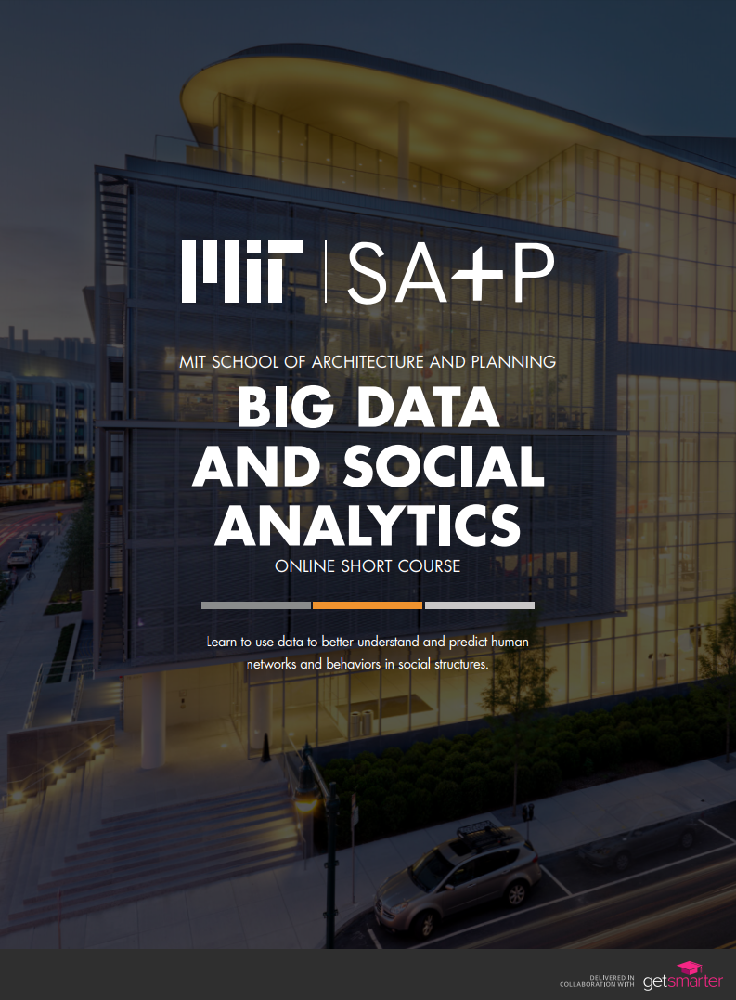

# Welcome to the MIT Big Data and Social Analytics certificate course.

This repository contains content from the MIT School of Architecture and Planning [Big data and social analytics online short course](https://www.getsmarter.com/courses/mit-sap-big-data-and-social-analytics-online-short-course). The Jupyter notebooks in this repository are provided to students in a hosted environment and should be used in combination with the video and other supporting material provided on the online campus.

### MODULE 1
#### FOUNDATIONS OF BIG DATA AND SOCIAL PHYSICS
Learn about the key terms and concepts related to big data and social physics as you explore the rules, laws, and policies that apply to the practice of big data analysis.

### MODULE 2
#### PERSONAL SENSORS AND HUMAN BEHAVIOR
Learn about how humans can be understood by looking at communication streams, idea flow, social networks, and social learning, and discover various sources of data collected through personal sensors.

### MODULE 3
#### FIRST-ORDER ANALYSIS AND DATA EXPLORATION
Explore the basics of data dynamics and data interrogation, and use basic statistical and visual data interrogation methods to analyze a data set.

### MODULE 4
#### NETWORK OF PHYSICAL INTERACTIONS
Engage with the basic concepts of peer networks, network theory, the structure of networks, and graph clustering.

### MODULE 5
#### SECOND-ORDER ANALYSIS AND DATA EXPLORATION
Progress to second-order analysis and discover the difference between correlation and causation, as well as techniques for differentiating between them.

### MODULE 6
#### USING DATA TO EFFECT BEHAVIOR CHANGE
Understand the concepts of social influence and social incentives, their impact on behavior change, and the importance of applying privacy-protecting methods to sensitive data.

### MODULE 7
#### APPLICATION OF BIG DATA IN INDUSTRY
Investigate problem set examples that cover application of big data insights in Healthcare, HR tech, Telco and Marketing. Combine what you have learned in Modules 1 to 6 to conduct a full cycle analysis on a large data set.

### MODULE 8
#### DATA IN ACTION
Examine problem set examples that look at the application of data in context and showcase data policy in action, and recommend interventions to be taken as a result of your analysis in Module 7.

**Notebook Contributors**:
**Andre Voges**, Mieszko Manijak, Gorden Jemwa, Arek Stopczynski, Xiaowen Dong, and Yves-Alexandre de Montjoye.
